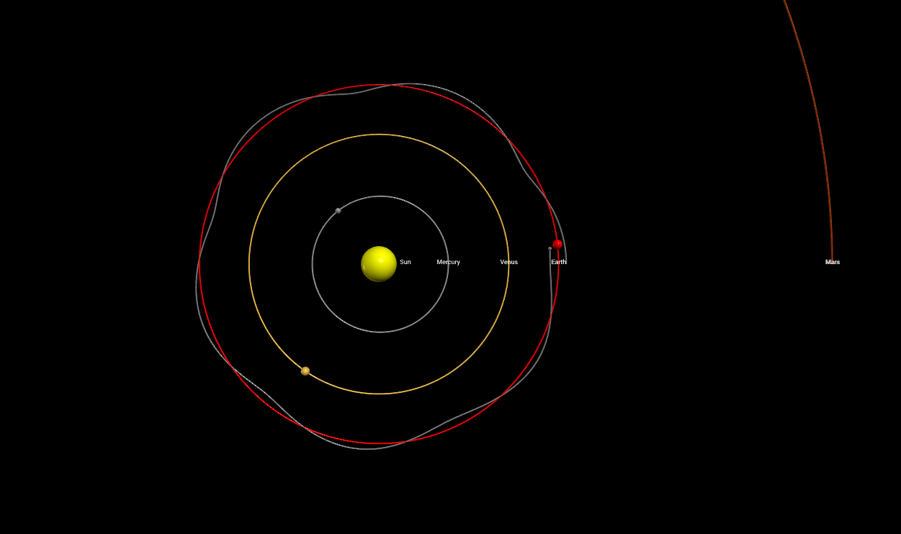

# 3D-Solar-System
A physically accurate 3D orbit simulation of the inner solar system built with Python and VPython.

## Features
- **Real Physics:** Uses Newton's Law of Universal Gravitation.
- **Three-Body Problem:** Includes the Earth-Moon system with gravity from both the Earth and the Sun.
- **Planets Included:** Mercury, Venus, Earth (with Moon), and Mars.
- **Interactivity:** Press the `Spacebar` to pause and resume the simulation.
- **Performance:** Includes a custom live FPS counter.

## How to Run
1. Install the required libraries:
   ```bash
   pip install vpython numpy
   ```
2. Run the simulation:
   ```bash
   python solarsystem.py
   ```

## Preview

